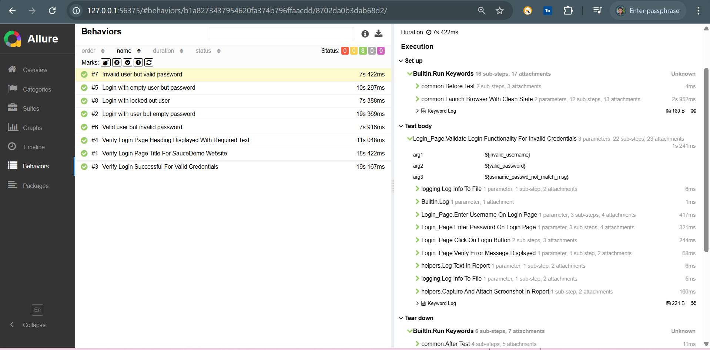
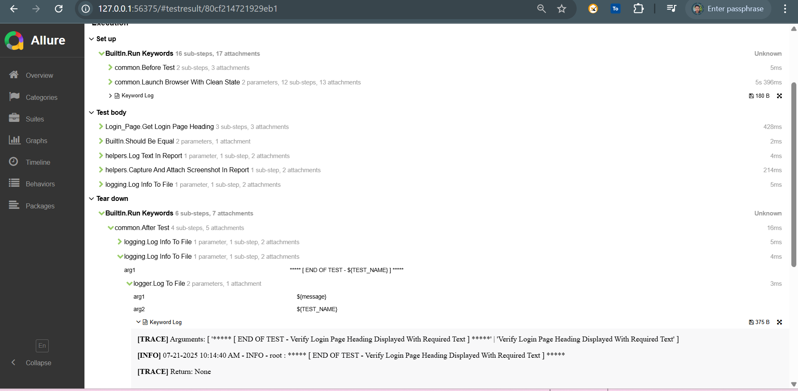
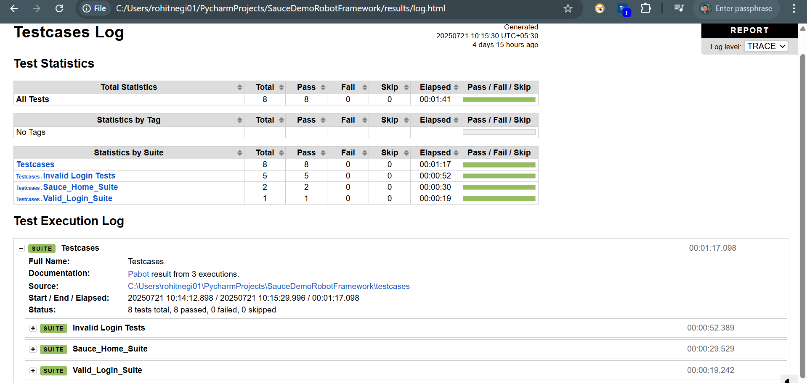
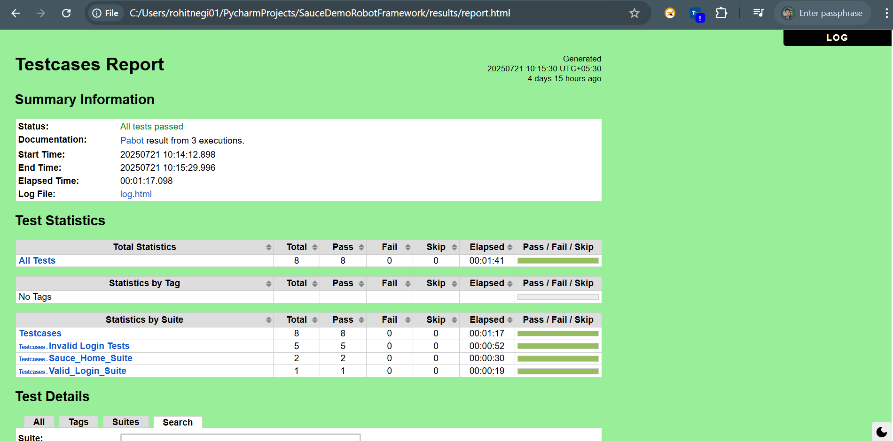

# Parallel UI Test Automation Framework using Robot Framework and Pabot Library
- This repository contains a modular and scalable UI automation framework built using **Robot Framework**, **Python**, and **Selenium** library. 
- It supports **parallel execution**, **data-driven testing**, and generates **detailed reports** using **Allure** and **Default Robot Framework Report**.
---
## 📂 Project Structure
```
│   .pabotsuitenames                                                      # Defines suite names or grouping when using Pabot (parallel execution tool).
│   README.md                                                             # Overview of the project, setup instructions, how to run tests, dependencies, and usage.      
│   requirements.txt                                                      # Lists Python packages needed (e.g., robotframework, pabot, allure-robotframework, etc.).
│   runtest.ps1                                                           # A PowerShell script that orchestrates running the full test suite via Robot Framework and Pabot, possibly including Allure report generation.
├───allure-report                                                         # Output directory of the generated Allure HTML report, giving a rich UI view of test execution data.
├───allure-results                                                        # Contains raw test result artifacts (JSON, XML, attachments) generated during execution—used for building Allure reports.
├───libraries
│   │   logger.py                                                         # A custom Python library module defining logging or reporting keywords for use in Robot scripts. Makes logs more structured and reusable across test suites.
├───logs                                                                  # Stores .log files generated for each test scenario, usually plain-text or structured logs
│       Invalid user but valid password_app.log
│       Login with empty user but password_app.log
│       Login with locked out user_app.log
│       Login with user but empty password_app.log
│       Valid user but invalid password_app.log
│       Verify Login Page Heading Displayed With Required Text_app.log
│       Verify Login Page Title For SauceDemo Website_app.log
│       Verify Login Successful For Valid Credentials_app.log
├───pages
│       Home_Page.resource                                               # Keywords for homepage validation, navigation flows.
│       Login_Page.resource                                              # Contains reusable keywords representing login screen interactions (enter username, password, click, etc.).
├───results
│   │   log.html                                                         # Detailed HTML log report generated by Robot Framework.
│   │   output.xml                                                       # Core Robot Framework execution data file (XML).
│   │   report.html                                                      # Summary HTML report (pass/fail, test suites, tags).
│   └───pabot_results                                                    # Pabot-specific subfolder capturing parallel execution results (separate directory)
├───testcases
│       Invalid_Login_Tests.robot                                        # Suite for negative login scenarios (wrong username, locked accounts, missing fields), data driven based
│       Sauce_Home_Tests.robot                                           # Tests for homepage behavior (home page display, title etc)
│       Valid_Login_Tests.robot                                          # Scenarios verifying successful login flows.
├───testdata
│   │   Invalid_Login_Tests.csv                                          # Data‑driven values for invalid login scenarios (usernames, passwords, error messages).
│   │   invalid_login_test_data.py                                       # Python-based data provider (perhaps used to parameterize tests programmatically).
└───utils                                                                # Shared support logic used across resources or tests:
        common.resource                                                  # Generic or cross-functional keywords (e.g. setup/teardown, navigation, global utilities).
        helpers.resource                                                 # Additional reusable utility keywords (e.g. element inspection, waits, assertions)
        logging.resource                                                 # Robot-level keyword wrappers for structured logging, potentially interfacing with logger.py.
```
---
## 🚀 Features
- ✅ **Pabot/robot based test runner**
- ✅ **Parallel testing** with `robotframework-pabot` library
- ✅ **Separate logging for each test**
- ✅ **Interactive Allure** and **Robot Framework HTML** reports
- ✅ **Template based driven data tests**
- ✅ **Custom utility functions**
- ✅ Supports **Custom logging library** and **Page Object Model**
---
## 🧰 Tools & Libraries Used
- pycharm/vscode
- robotframework
- robotframework-seleniumlibrary
- allure-robotframework
- robotframework-pabot
---
## 📝 Logging
- Each test creates a separate log file under the logs/ directory using a custom logger defined in `utils/logging.resource and libraries/logger.py`.
---
## 📂 Sample Test Types
- 🔁 Basic validations on Homepage (title, heading etc)
- 📄 Validation of successful login
- 🔐 Validation of invalid logins and error messages based on data driven approach
---
## 📈 Reporting
- ✅ Allure : Provides interactive test results, Captures logs, attachments
- ✅ Report HTML : Generates Default Robot Framework HTML Report
---
### 🔄 Parallel Execution
- This framework uses `robotframework-pabot` to execute tests in parallel:
```commandline
#Split execution on test level instead of default suite level
pabot --testlevelsplit
```
- You can also control the number of workers:
```commandline
#How many parallel executors to use (default max of 2 and cpu count).
pabot --processes
```
---
## 🧪 How to Run Tests
### Pre-requisites
- You should have python & allure cli installed on your system, if not please install
- [Python](https://www.python.org/downloads/)
- Allure CLI [here](https://allurereport.org/docs/install)
- IDE of your choice for ex: [Pycharm](https://jetbrains.com/pycharm/download) Or [VS Code](https://code.visualstudio.com/download)
- Clone/download the repo on your system, open in IDE or navigate to project root directory

### 1. 📦 Install Dependencies
```bash
pip install -r requirements.txt
```
### 2. 📦 Run All Tests (with Allure and HTML reports)
```bash
pabot --processes 3 --loglevel TRACE -d results --listener allure_robotframework:allure-results testcases
```
### 3. 📦 Generating Allure Report
```bash
allure generate allure-results -o allure-report --clean
```
### 4. 📦 Opening Allure And Robot Framework Default HTML Reports in browser
```bash
# Open Robot Framework Default Report
Start-Process "results\report.html"
# Open Allure Report
Start-Process "allure" -ArgumentList "open", "allure-report"
```
### 5. 📦 Or directly run **runtest.ps1** in **powershell mode** if **python** and **allure-cli** is installed
- This will first clear the
  - **allure-results**: directory that generates with **xml** and **json** files for allure report generation post test execution, so that we get fresh version of these file on each run
  - **results**: directory that contains the **report.html** i.e, self-contained html report generated by **pytest-html**
  - **logs**: directory containing separate log file for each executed test in parallel mode using **pytest-xdist**
- Install dependencies as mentioned in **step 1**
- Run All Tests with **Allure, HTML reports** options leveraging `robotframework-pabot` option **--processes 3** to distribute 3 tests at a time based on file for parallel testing as per **step 2**
- Generate allure report in **allure-report** directory based on xml/json file generated in **allure-results** directory as per **step 3**
- Directly open **Robot Framework Default HTML Report** from **results\report.html** directory and interactive **allure report** from **allure-report** in your system default browser as per **step 4**
---
## 📊 Sample Reports
### ✅ Allure Report



### ✅ Robot Framework Default Report


---
## 🙋‍♂️ Author: Rohit Negi
- 📧 Email: [rohitnegichd@gmail.com](mailto:rohitnegichd@gmail.com)
- 📞 Phone: [+91-8077683563](tel:+91-8077683563)
- 🔗 LinkedIn: [linkedin.com/in/halloichbinrohit](https://www.linkedin.com/in/halloichbinrohit/)